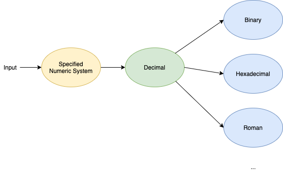

# Numerals
CLI to deal with encoding/decoding of numerals.

## Run
```
$ go get github.com/herlon214/numerals/cmd/numerals
$ numerals
 _____ _____ _____ _____ _____ _____ __    _____
|   | |  |  |     |   __| __  |  _  |  |  |   __|
| | | |  |  | | | |   __|    -|     |  |__|__   |
|_|___|_____|_|_|_|_____|__|__|__|__|_____|_____|

Available number systems:
- [0] Decimal
- [1] Binary
- [2] Hexadecimal
- [3] Roman
-------------------------------------------------------------------------
Which one do you want to use? (type the system's number)
```

You can also clone the repo and run it using `make run` or `go run cmd/numerals/main.go`.


## How the conversions are made


## Code coverage
```
?   	github.com/herlon214/numerals/cmd/numerals	[no test files]
ok  	github.com/herlon214/numerals/pkg/number	0.247s	coverage: 100.0% of statements in ./pkg/...
github.com/herlon214/numerals/pkg/number/binary.go:11:		NewBinarySystem		100.0%
github.com/herlon214/numerals/pkg/number/binary.go:15:		Name			100.0%
github.com/herlon214/numerals/pkg/number/binary.go:19:		Decode			100.0%
github.com/herlon214/numerals/pkg/number/binary.go:28:		Encode			100.0%
github.com/herlon214/numerals/pkg/number/decimal.go:9:		NewDecimalSystem	100.0%
github.com/herlon214/numerals/pkg/number/decimal.go:13:		Name			100.0%
github.com/herlon214/numerals/pkg/number/decimal.go:17:		Decode			100.0%
github.com/herlon214/numerals/pkg/number/decimal.go:26:		Encode			100.0%
github.com/herlon214/numerals/pkg/number/hexadecimal.go:12:	NewHexadecimalSystem	100.0%
github.com/herlon214/numerals/pkg/number/hexadecimal.go:16:	Name			100.0%
github.com/herlon214/numerals/pkg/number/hexadecimal.go:20:	Decode			100.0%
github.com/herlon214/numerals/pkg/number/hexadecimal.go:29:	Encode			100.0%
github.com/herlon214/numerals/pkg/number/roman.go:36:		NewRomanSystem		100.0%
github.com/herlon214/numerals/pkg/number/roman.go:40:		Name			100.0%
github.com/herlon214/numerals/pkg/number/roman.go:44:		Decode			100.0%
github.com/herlon214/numerals/pkg/number/roman.go:80:		Encode			100.0%
github.com/herlon214/numerals/pkg/number/roman.go:97:		isValid			100.0%
total:								(statements)		100.0%
```

## Benchmarks
```
$ make bench
goos: darwin
goarch: amd64
pkg: github.com/herlon214/numerals/pkg/number
BenchmarkEncodeBinary-8        	16559230	        70.0 ns/op
BenchmarkDecodeBinary-8        	10551765	       113 ns/op
BenchmarkEncodeDecimal-8       	24104967	        46.7 ns/op
BenchmarkDecodeDecimal-8       	23961109	        47.3 ns/op
BenchmarkEncodeHexadecimal-8   	 9897879	       115 ns/op
BenchmarkDecodeHexadecimal-8   	23189104	        46.9 ns/op
BenchmarkEncodeRoman-8         	 5427507	       221 ns/op
BenchmarkDecodeRoman-8         	 5762856	       209 ns/op
PASS
ok  	github.com/herlon214/numerals/pkg/number	10.251s
```